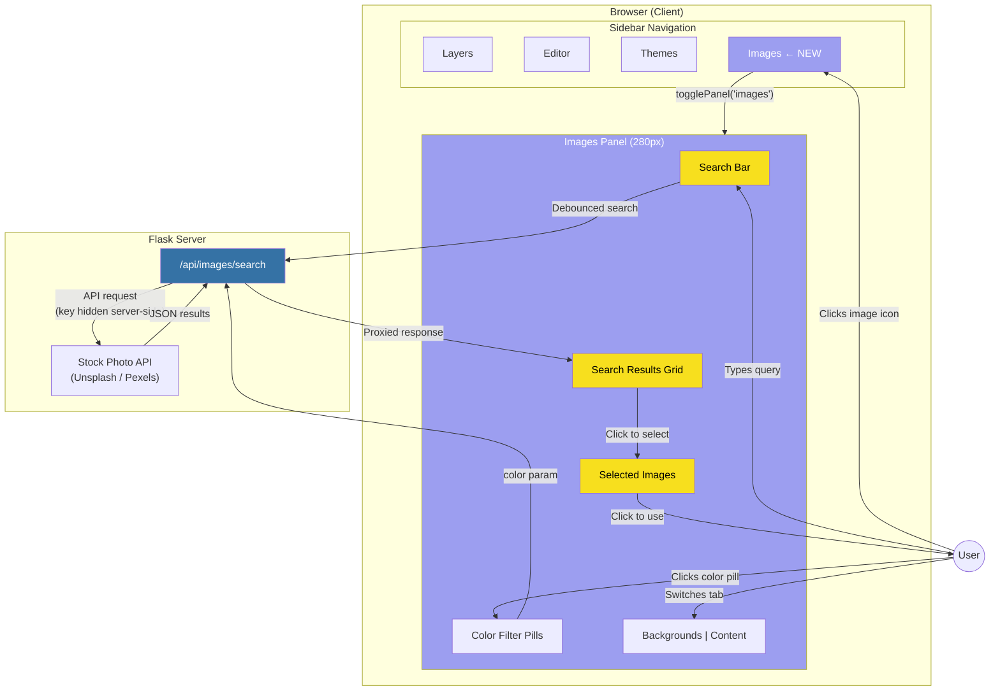
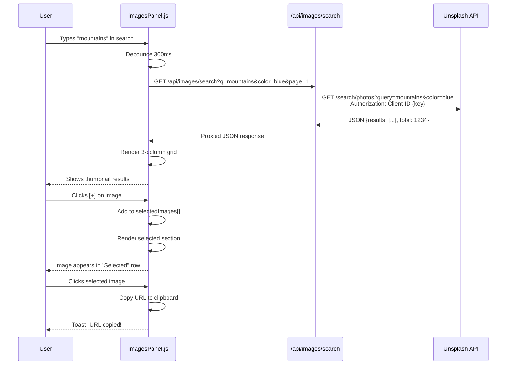
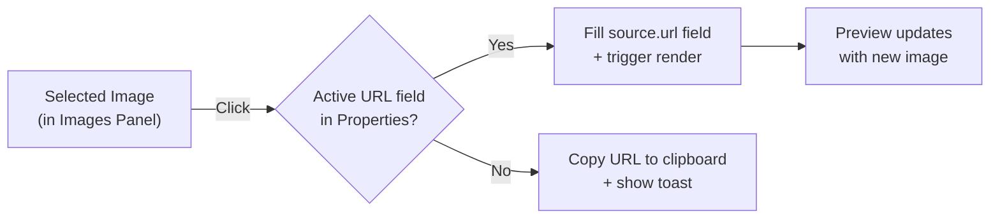
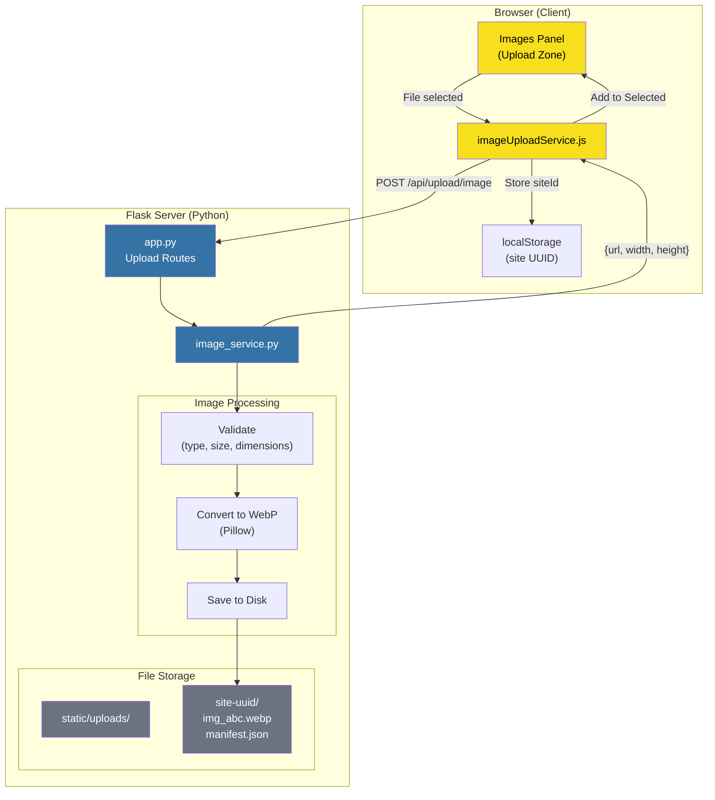
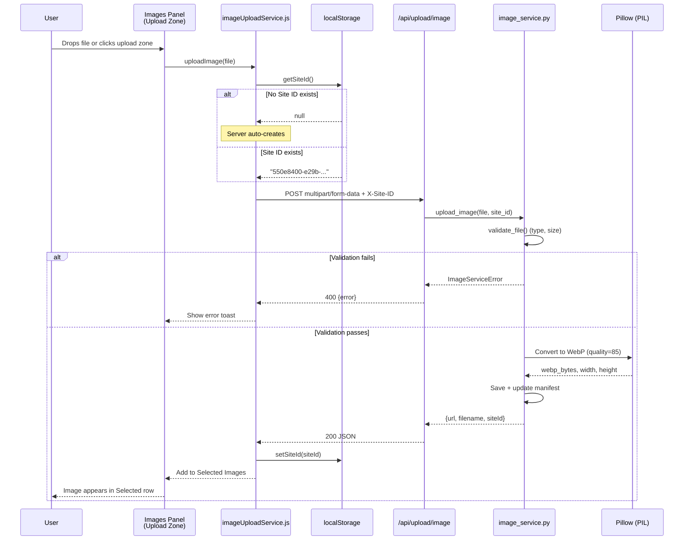
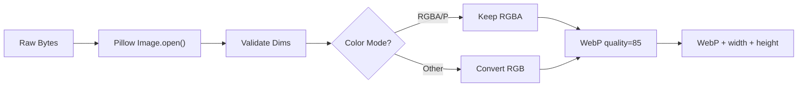
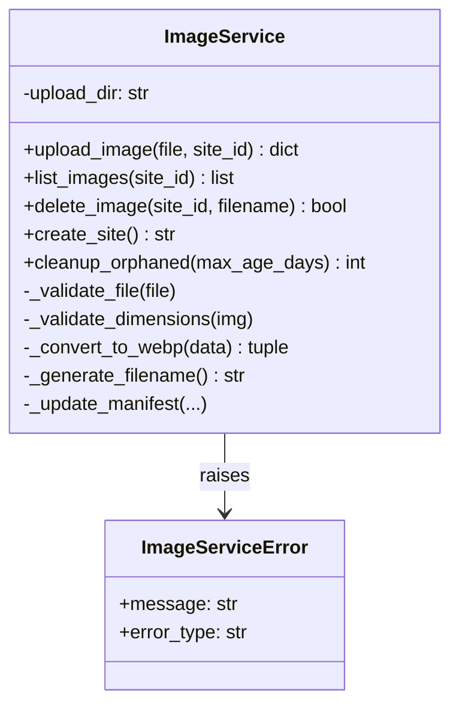
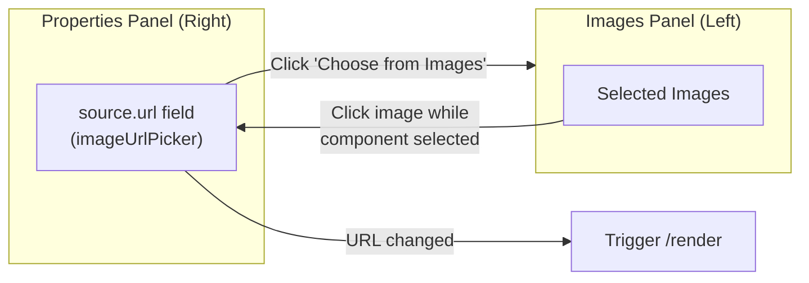
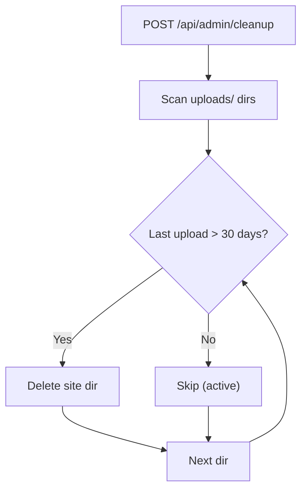

# Image Management Enhancement Plan

## Overview

Add a dedicated **Images Panel** to the sidebar for browsing, searching, and selecting stock photos, plus image upload with WebP conversion and per-site storage. The Images Panel becomes the central hub for all image assets used in website creation.

---

## Current State Analysis

### How Images Work Today

Images are **external URLs only** — users manually paste URLs from Unsplash, Pexels, Giphy into YAML:

```yaml
- name: image
  properties:
    source:
      url: 'https://images.unsplash.com/photo-1481627834876?w=1920&q=80'
      altText: 'Bookstore interior'
```

| Aspect | Current State |
|--------|---------------|
| Image sources | External URLs only (manual copy-paste) |
| Image browsing | None — user must leave app to find images |
| Local storage | None — no upload infrastructure |
| Side panels | Layers, Editor, Themes (no Images panel) |
| Icon sprite | `#icon-image` already exists in sprite |

---

## Phase 1: Images Panel (Side Panel)

### Architecture Overview



### Panel Wireframe

```
┌─ Images ─────────────────── [×] ─┐
│                                    │
│  ┌──────────────────────── 🔍 ─┐  │
│  │ Search photos...             │  │
│  └──────────────────────────────┘  │
│                                    │
│  Colors:                           │
│  (●)(●)(●)(●)(●)(●)(●)(○)         │
│  red org ylw grn blu pur blk wht   │
│                                    │
│  [Backgrounds]  [Content]          │
│  ─────────────────────────────     │
│                                    │
│  ┌──────┐ ┌──────┐ ┌──────┐      │
│  │      │ │      │ │      │      │
│  │  🖼  │ │  🖼  │ │  🖼  │      │
│  │      │ │      │ │      │      │
│  │  [+] │ │  [+] │ │  [+] │      │
│  └──────┘ └──────┘ └──────┘      │
│  ┌──────┐ ┌──────┐ ┌──────┐      │
│  │      │ │      │ │      │      │
│  │  🖼  │ │  🖼  │ │  🖼  │      │
│  │      │ │      │ │      │      │
│  │  [+] │ │  [+] │ │  [+] │      │
│  └──────┘ └──────┘ └──────┘      │
│                                    │
│  [Load More]                       │
│                                    │
│  ─── Selected (3) ───────────      │
│                                    │
│  ┌────┐ ┌────┐ ┌────┐            │
│  │ 🖼 │ │ 🖼 │ │ 🖼 │            │
│  │ [×]│ │ [×]│ │ [×]│            │
│  └────┘ └────┘ └────┘            │
│  Beach   Office  Food             │
│                                    │
│  ─── Upload ─────────────────     │
│  ┌──────────────────────────────┐ │
│  │  Drop image or click to      │ │
│  │  upload from your device     │ │
│  └──────────────────────────────┘ │
│                                    │
└────────────────────────────────────┘
```

### Panel Sections Explained

#### 1. Search Bar
- Text input with search icon
- Debounced (300ms) — triggers API search on typing
- Placeholder: "Search photos..."
- Searches the stock photo API (Unsplash or Pexels) via server proxy

#### 2. Color Filter Pills
- Row of circular color swatches users can click to filter results
- Available colors:

| Color | API Value | Swatch |
|-------|-----------|--------|
| Red | `red` | Solid red circle |
| Orange | `orange` | Solid orange circle |
| Yellow | `yellow` | Solid yellow circle |
| Green | `green` | Solid green circle |
| Blue | `blue` | Solid blue circle |
| Purple | `purple` | Solid purple circle |
| Black | `black` | Solid black circle |
| White | `white` | White circle with border |

- Single-select toggle (click again to deselect)
- Combines with search query: "mountains" + blue → blue mountain photos
- Active color gets a highlight ring (accent color)

#### 3. Category Tabs: Backgrounds vs Content

Two tabs filter search results by intent:

| Tab | Purpose | Default Search Terms | Typical Results |
|-----|---------|---------------------|-----------------|
| **Backgrounds** | Full-width hero images, section backgrounds, textures | "texture", "abstract", "landscape", "gradient" | Wide/landscape images, patterns, textures |
| **Content** | Product photos, team photos, illustrations for page content | "business", "people", "product", "food" | Subject-focused images, various aspect ratios |

- Active tab has underline accent indicator
- Switching tabs appends orientation hints to the API query:
  - Backgrounds: `&orientation=landscape`
  - Content: no orientation filter

#### 4. Search Results Grid
- 3-column masonry grid within the 280px panel (~82px per thumbnail)
- Each result card shows:
  - Thumbnail image (cropped square or aspect-preserved)
  - Photographer credit (small text below, links to source per API terms)
  - **[+] Select button** — overlay on hover
- Infinite scroll or "Load More" button for pagination
- Loading state: skeleton placeholder cards
- Empty state: "No results found" message

#### 5. Selected Images Section
- Collapsible section below results: "Selected (N)"
- Shows thumbnails of all images the user has picked
- Each selected image has:
  - Small thumbnail
  - Short label (from search query or photographer)
  - **[×] Remove button** — deselects the image
- Selected images are stored in module state (array of image objects)
- These images are available for use in the YAML editor via:
  - Click on selected image → copies URL to clipboard with toast notification
  - Drag from selected images into the properties panel URL field (future)
  - When a component `source.url` field is active, clicking a selected image fills it

#### 6. Upload Section (Bottom)
- Dashed-border drop zone at the bottom of the panel
- "Drop image or click to upload from your device"
- Triggers the upload flow (Phase 2) when implemented
- Initially can be a simple file input that calls `/api/upload/image`

### Search Flow (Sequence Diagram)



### HTML Structure (in `index.html`)

Following the exact pattern of the existing panels:

```html
<!-- In sidebar nav (after themes button) -->
<button class="sidebar-btn" data-panel="images" title="Images">
    <svg aria-hidden="true"><use href="#icon-image"></use></svg>
    <span class="sidebar-btn-tooltip">Images</span>
</button>

<!-- Panel container (after themesPanel) -->
<div class="sidebar-panel" id="imagesPanel">
    <div class="panel-header">
        <span class="panel-title">Images</span>
        <button class="panel-close" onclick="window.closePanel()">
            <svg aria-hidden="true"><use href="#icon-x"></use></svg>
        </button>
    </div>
    <div class="panel-content" id="imagesContent">
        <!-- Dynamic content rendered by imagesPanel.js -->
    </div>
</div>
```

### JavaScript Module: `imagesPanel.js`

Follows the `themesPanel.js` pattern exactly:

```javascript
// ssr_python/static/js/imagesPanel.js

// Module state
let searchQuery = '';
let activeColor = null;
let activeCategory = 'backgrounds';  // 'backgrounds' | 'content'
let searchResults = [];
let selectedImages = [];             // Persisted in localStorage
let currentPage = 1;
let isLoading = false;

// Constants
const DEBOUNCE_MS = 300;
const RESULTS_PER_PAGE = 30;
const STORAGE_KEY = 'swift_sites_selected_images';

const COLOR_OPTIONS = [
    { value: 'red', label: 'Red', hex: '#EF4444' },
    { value: 'orange', label: 'Orange', hex: '#F97316' },
    { value: 'yellow', label: 'Yellow', hex: '#EAB308' },
    { value: 'green', label: 'Green', hex: '#22C55E' },
    { value: 'blue', label: 'Blue', hex: '#3B82F6' },
    { value: 'purple', label: 'Purple', hex: '#A855F7' },
    { value: 'black', label: 'Black', hex: '#1A1A1A' },
    { value: 'white', label: 'White', hex: '#FFFFFF' },
];

/**
 * Render the images panel (called when panel opens)
 */
export function renderImagesPanel() {
    const container = document.getElementById('imagesContent');
    if (!container) return;

    // Load selected images from localStorage
    loadSelectedImages();

    container.innerHTML = `
        <!-- Search Bar -->
        <div class="images-search">
            <input type="text" class="images-search-input"
                   placeholder="Search photos..."
                   value="${searchQuery}">
            <svg class="images-search-icon" aria-hidden="true">
                <use href="#icon-search"></use>
            </svg>
        </div>

        <!-- Color Filters -->
        <div class="images-colors">
            <span class="images-colors-label">Colors:</span>
            <div class="images-color-pills">
                ${renderColorPills()}
            </div>
        </div>

        <!-- Category Tabs -->
        <div class="images-tabs">
            <button class="images-tab ${activeCategory === 'backgrounds' ? 'active' : ''}"
                    data-category="backgrounds">Backgrounds</button>
            <button class="images-tab ${activeCategory === 'content' ? 'active' : ''}"
                    data-category="content">Content</button>
        </div>

        <!-- Results Grid -->
        <div class="images-results" id="imagesResults">
            ${isLoading ? renderSkeletons() : renderResults()}
        </div>

        <!-- Load More -->
        <div class="images-load-more" id="imagesLoadMore" style="display: none;">
            <button class="images-load-more-btn">Load More</button>
        </div>

        <!-- Selected Images -->
        <div class="images-selected-section">
            <div class="images-selected-header">
                Selected (${selectedImages.length})
            </div>
            <div class="images-selected-grid" id="imagesSelectedGrid">
                ${renderSelectedImages()}
            </div>
        </div>

        <!-- Upload Zone -->
        <div class="images-upload-zone" id="imagesUploadZone">
            <span class="images-upload-text">
                Drop image or click to upload
            </span>
            <input type="file" class="images-upload-input"
                   accept="image/*" hidden>
        </div>
    `;

    attachImagesPanelEvents(container);
}

function attachImagesPanelEvents(container) {
    // Search input with debounce
    // Color pill clicks
    // Category tab switching
    // Result card [+] select buttons
    // Selected image click (copy URL) and [×] remove
    // Load More button
    // Upload zone click/drop
}
```

### API Proxy Route

Server-side proxy hides the API key from the browser:

```python
# In app.py

@app.route('/api/images/search')
def search_images():
    """Proxy stock photo search — hides API key from client."""
    query = request.args.get('q', '')
    color = request.args.get('color', '')
    page = request.args.get('page', 1, type=int)
    orientation = request.args.get('orientation', '')
    per_page = request.args.get('per_page', 30, type=int)

    # Call Unsplash API (or Pexels)
    params = {
        'query': query,
        'page': page,
        'per_page': min(per_page, 30),
    }
    if color:
        params['color'] = color
    if orientation:
        params['orientation'] = orientation

    headers = {
        'Authorization': f'Client-ID {UNSPLASH_ACCESS_KEY}'
    }

    resp = requests.get(
        'https://api.unsplash.com/search/photos',
        params=params,
        headers=headers,
        timeout=10
    )
    return jsonify(resp.json())
```

### Stock Photo API Comparison

| Feature | Unsplash API | Pexels API |
|---------|-------------|------------|
| Free tier | 50 req/hour (demo) | 200 req/hour |
| Color filter | `color` param (16 options) | `color` param (limited) |
| Orientation | `orientation` (landscape/portrait/squarish) | `orientation` (landscape/portrait/square) |
| Attribution | Required (photographer + Unsplash link) | Required (photographer credit) |
| Image quality | Excellent, curated | Good, large catalog |
| API key | `UNSPLASH_ACCESS_KEY` env var | `PEXELS_API_KEY` env var |

**Recommendation:** Start with **Unsplash** — better color filtering, higher quality, well-documented API. Can add Pexels as a fallback later.

### Selected Images Persistence

Selected images survive browser refresh via `localStorage`:

```javascript
// Save
localStorage.setItem('swift_sites_selected_images', JSON.stringify(selectedImages));

// Each selected image object:
{
    id: 'unsplash_abc123',
    url: 'https://images.unsplash.com/photo-xxx?w=1920&q=80',
    thumbUrl: 'https://images.unsplash.com/photo-xxx?w=200&q=80',
    photographer: 'John Doe',
    photographerUrl: 'https://unsplash.com/@johndoe',
    altText: 'Mountain landscape',
    source: 'unsplash',
    category: 'backgrounds'  // or 'content'
}
```

### Using Selected Images in Website

When user wants to use a selected image:



**Integration with Properties Panel:**
- When a component with `source.url` is selected, clicking a selected image auto-fills the URL
- The `swift-selection-changed` event (already exists) tells the Images Panel which component is active
- If no component is selected, clicking copies the URL to clipboard

---

## Phase 1 — File Summary

### New Files

| File | Purpose |
|------|---------|
| `ssr_python/static/js/imagesPanel.js` | Images panel module (search, colors, select, render) |
| `ssr_python/static/css/images-panel.css` | Images panel styling |

### Modified Files

| File | Changes |
|------|---------|
| `ssr_python/templates/index.html` | Add sidebar button + panel container |
| `ssr_python/static/js/main.js` | Import imagesPanel, expose `window.renderImagesPanel` |
| `ssr_python/static/js/events.js` | Add `images` case to `togglePanel()` |
| `ssr_python/app.py` | Add `/api/images/search` proxy route |
| `ssr_python/requirements.txt` | Add `requests` (for API proxy) |
| `ssr_python/static/icon-sprite.svg` | Add `#icon-search` if not present |

### CSS Design (`images-panel.css`)

```css
/* Search Bar */
.images-search { position: relative; margin-bottom: 12px; }
.images-search-input {
    width: 100%; padding: 8px 12px 8px 32px;
    background: var(--bg-dark); border: 1px solid var(--border);
    border-radius: 6px; color: var(--text); font-size: 13px;
}
.images-search-icon {
    position: absolute; left: 8px; top: 50%;
    transform: translateY(-50%); width: 16px; height: 16px;
    color: var(--text-muted);
}

/* Color Pills */
.images-color-pills { display: flex; gap: 6px; flex-wrap: wrap; }
.images-color-pill {
    width: 24px; height: 24px; border-radius: 50%;
    border: 2px solid transparent; cursor: pointer;
    transition: all 0.15s ease;
}
.images-color-pill:hover { transform: scale(1.15); }
.images-color-pill.active {
    border-color: var(--accent);
    box-shadow: 0 0 0 2px var(--accent-soft);
}
.images-color-pill[data-color="white"] {
    border-color: var(--border);  /* visible border for white */
}

/* Category Tabs */
.images-tabs {
    display: flex; gap: 0; margin-bottom: 12px;
    border-bottom: 1px solid var(--border);
}
.images-tab {
    flex: 1; padding: 8px; text-align: center;
    background: none; border: none; border-bottom: 2px solid transparent;
    color: var(--text-muted); font-size: 12px; font-weight: 500;
    cursor: pointer; transition: all 0.15s ease;
}
.images-tab.active {
    color: var(--accent); border-bottom-color: var(--accent);
}

/* Results Grid — 3 columns */
.images-results {
    display: grid; grid-template-columns: repeat(3, 1fr);
    gap: 4px; margin-bottom: 12px;
}
.images-result-card {
    position: relative; border-radius: 4px; overflow: hidden;
    cursor: pointer; aspect-ratio: 1;
}
.images-result-card img {
    width: 100%; height: 100%; object-fit: cover;
}
.images-result-card .images-select-btn {
    position: absolute; bottom: 4px; right: 4px;
    width: 24px; height: 24px; border-radius: 50%;
    background: rgba(0,0,0,0.6); color: white; border: none;
    font-size: 16px; cursor: pointer;
    opacity: 0; transition: opacity 0.15s ease;
}
.images-result-card:hover .images-select-btn { opacity: 1; }
.images-result-card.selected .images-select-btn {
    opacity: 1; background: var(--accent);
}
.images-result-credit {
    font-size: 9px; color: var(--text-dim);
    padding: 2px 4px; white-space: nowrap;
    overflow: hidden; text-overflow: ellipsis;
}

/* Skeleton loading */
.images-skeleton {
    background: var(--bg-dark); border-radius: 4px;
    aspect-ratio: 1; animation: skeleton-pulse 1.5s infinite;
}
@keyframes skeleton-pulse {
    0%, 100% { opacity: 0.4; }
    50% { opacity: 0.8; }
}

/* Selected Images Section */
.images-selected-section {
    border-top: 1px solid var(--border);
    padding-top: 12px; margin-top: 8px;
}
.images-selected-header {
    font-size: 11px; font-weight: 600; color: var(--text-muted);
    text-transform: uppercase; letter-spacing: 0.05em;
    margin-bottom: 8px;
}
.images-selected-grid {
    display: flex; gap: 6px; flex-wrap: wrap;
}
.images-selected-thumb {
    position: relative; width: 52px; height: 52px;
    border-radius: 4px; overflow: hidden; cursor: pointer;
}
.images-selected-thumb img {
    width: 100%; height: 100%; object-fit: cover;
}
.images-selected-thumb .images-remove-btn {
    position: absolute; top: 2px; right: 2px;
    width: 16px; height: 16px; border-radius: 50%;
    background: rgba(0,0,0,0.7); color: white; border: none;
    font-size: 10px; line-height: 16px; text-align: center;
    cursor: pointer; opacity: 0; transition: opacity 0.15s ease;
}
.images-selected-thumb:hover .images-remove-btn { opacity: 1; }
.images-selected-label {
    font-size: 9px; color: var(--text-dim);
    text-align: center; margin-top: 2px;
    white-space: nowrap; overflow: hidden;
    text-overflow: ellipsis; max-width: 52px;
}

/* Upload Zone */
.images-upload-zone {
    margin-top: 12px; padding: 16px;
    border: 2px dashed var(--border); border-radius: 8px;
    text-align: center; cursor: pointer;
    transition: all 0.15s ease;
}
.images-upload-zone:hover {
    border-color: var(--accent);
    background: var(--accent-soft);
}
.images-upload-text {
    font-size: 12px; color: var(--text-muted);
}
```

---

## Phase 1 — Panel Toggle Integration

### `events.js` Changes

Add `images` to the special-case rendering in `togglePanel()`:

```javascript
// In togglePanel(), after the themes special case:
if (panelName === 'images' && window.renderImagesPanel) {
    window.renderImagesPanel();
}
```

### `main.js` Changes

```javascript
import { renderImagesPanel } from './imagesPanel.js';

// In init():
window.renderImagesPanel = renderImagesPanel;
```

---

## Phase 2: Image Upload & WebP Conversion

### Architecture Overview



### Upload Flow



### Site Identity: UUID-Based

| Option | Pros | Cons | Chosen? |
|--------|------|------|---------|
| **UUID in localStorage** | No database, survives restart | No cross-device | **Yes** |
| Session cookie | Auto-managed | Lost on close | No |
| SQLite database | Full project mgmt | Over-engineered | Future |

### Storage Structure

```
ssr_python/static/uploads/
├── .gitkeep
├── 550e8400-e29b-.../
│   ├── img_a1b2c3d4e5f6.webp
│   ├── img_g7h8i9j0k1l2.webp
│   └── manifest.json
└── 7c9e6679-7425-.../
    ├── img_m3n4o5p6q7r8.webp
    └── manifest.json
```

### Manifest Format

```json
{
  "images": [
    {
      "filename": "img_a1b2c3d4e5f6.webp",
      "originalName": "hero-banner.jpg",
      "uploadedAt": "2026-02-06T10:30:00Z",
      "sizeBytes": 45321
    }
  ]
}
```

### API Endpoints

| Route | Method | Purpose |
|-------|--------|---------|
| `/api/upload/image` | POST | Upload + WebP convert |
| `/api/site/create` | POST | Create new site UUID |
| `/api/site/{id}/images` | GET | List site's uploaded images |
| `/api/site/{id}/images/{file}` | DELETE | Delete an uploaded image |

### Validation Rules

| Rule | Value |
|------|-------|
| Max file size | 10 MB |
| Allowed types | JPEG, PNG, GIF, WebP, BMP, TIFF |
| Output format | WebP (always) |
| WebP quality | 85 |
| Max dimension | 4096px per side |
| Min dimension | 10px per side |
| Max per site | 100 images |

### WebP Conversion Pipeline



### Backend: `image_service.py`



### Frontend: `imageUploadService.js`

```javascript
export const imageUploadService = {
    getSiteId()              // Read from localStorage
    setSiteId(id)            // Store in localStorage
    async uploadImage(file)  // POST /api/upload/image
    async listImages()       // GET /api/site/{id}/images
    async deleteImage(name)  // DELETE /api/site/{id}/images/{name}
}
```

### Phase 2 — New Files

| File | Purpose |
|------|---------|
| `ssr_python/image_service.py` | Image processing service |
| `ssr_python/static/js/imageUploadService.js` | Frontend upload API |

### Phase 2 — Modified Files

| File | Changes |
|------|---------|
| `ssr_python/app.py` | Add 4 upload/site routes |
| `ssr_python/requirements.txt` | Add `Pillow>=10.0.0` |
| `ssr_python/static/js/imagesPanel.js` | Wire upload zone to service |
| `.gitignore` | Add `ssr_python/static/uploads/*/` |

---

## Phase 3: Properties Panel Integration

Connect the Images Panel to the component properties workflow.

### `imageUrlPicker` Custom Renderer

Replace the plain text input for `source.url` in the Properties Panel:

```
┌─────────────────────────────────────────┐
│  Image                                  │
│  ┌───────────────────────────────────┐  │
│  │ https://example.com/img.webp      │  │
│  └───────────────────────────────────┘  │
│                                         │
│  ┌───────────────────────┐              │
│  │  (thumbnail preview)  │              │
│  └───────────────────────┘              │
│                                         │
│  [Choose from Images Panel]             │
│  [Upload from Device]                   │
└─────────────────────────────────────────┘
```

### Schema Change

```yaml
# component_schemas.yaml — Before:
- path: source.url
  type: text
  label: Image URL

# After:
- path: source.url
  type: custom
  renderer: imageUrlPicker
  label: Image
```

### Bidirectional Selection Flow



### Phase 3 — Modified Files

| File | Changes |
|------|---------|
| `ssr_python/static/js/customRenderers.js` | Add `imageUrlPicker` renderer |
| `component_schemas.yaml` | Change image/gif/video `source.url` type |
| `ssr_python/static/js/imagesPanel.js` | Listen for `swift-selection-changed`, auto-fill URL |

---

## Security Considerations

| Threat | Mitigation |
|--------|------------|
| API key exposure | Server-side proxy hides keys |
| Malicious file upload | Pillow validates actual content |
| Path traversal | UUID validation + generated filenames |
| Storage exhaustion | 100 images per site limit |
| XSS via filename | Never use original names in paths/HTML |
| CSP violation | Already allows `img-src 'self' https:` |

---

## Cleanup Strategy



---

## Environment Variables

```bash
# Stock Photo API (Phase 1)
UNSPLASH_ACCESS_KEY=your_key_here    # Get from https://unsplash.com/developers

# Image Upload (Phase 2)
# No additional env vars needed — uses filesystem storage
```

---

## Dependencies

```
# requirements.txt additions
requests>=2.31.0    # Phase 1: API proxy for stock photos
Pillow>=10.0.0      # Phase 2: WebP conversion
```

---

## Implementation Order

```mermaid
gantt
    title Implementation Phases
    dateFormat X
    axisFormat %s

    section Phase 1 - Images Panel
    Add sidebar button + panel HTML     :p1a, 0, 1
    Create imagesPanel.js               :p1b, 1, 4
    Add /api/images/search proxy        :p1c, 1, 3
    Create images-panel.css             :p1d, 1, 3
    Wire panel toggle in events.js      :p1e, 4, 5
    Selected images + localStorage      :p1f, 4, 6
    Test search + color + select        :p1g, 6, 7

    section Phase 2 - Upload + WebP
    Add Pillow dependency               :p2a, 7, 8
    Create image_service.py             :p2b, 8, 11
    Add upload routes to app.py         :p2c, 11, 12
    Create imageUploadService.js        :p2d, 11, 13
    Wire upload zone in panel           :p2e, 13, 14
    Test upload + WebP conversion       :p2f, 14, 15

    section Phase 3 - Properties Integration
    Add imageUrlPicker renderer         :p3a, 15, 17
    Update component schemas            :p3b, 17, 18
    Bidirectional selection flow         :p3c, 18, 19
    End-to-end testing                  :p3d, 19, 20
```



---

## Verification Checklist

### Phase 1
- [ ] Images button appears in sidebar with `#icon-image`
- [ ] Clicking button opens Images panel (280px slide-out)
- [ ] Search bar triggers API search with debounce
- [ ] Color pills filter results (active state visible)
- [ ] Backgrounds/Content tabs switch orientation filter
- [ ] 3-column grid displays search results with thumbnails
- [ ] Hover shows [+] select button on result cards
- [ ] Clicking [+] adds image to Selected section
- [ ] Selected images persist in localStorage across refresh
- [ ] Clicking selected image copies URL to clipboard
- [ ] Photographer credit shown per API terms

### Phase 2
- [ ] Upload zone accepts drag-and-drop or click
- [ ] JPEG/PNG uploaded → saved as `.webp`
- [ ] Uploaded image appears in Selected section
- [ ] Site UUID persists in localStorage
- [ ] Multiple uploads go to same site directory
- [ ] 15MB file → error "File too large"

### Phase 3
- [ ] Properties panel shows imageUrlPicker for `source.url`
- [ ] "Choose from Images Panel" opens Images Panel
- [ ] Clicking selected image fills active URL field
- [ ] Preview updates with selected image

---

## Future Enhancements (Out of Scope)

| Enhancement | Description |
|-------------|-------------|
| Pexels API fallback | Add second stock photo source |
| AI image generation | Generate images from text descriptions |
| Image cropping | Crop/resize before use |
| Favorites / collections | Organize images into named collections |
| Drag-and-drop to preview | Drag image from panel directly into preview |
| CDN integration | Serve uploaded images through CDN |
| SQLite persistence | Full project save/load with database |

---

**Last Updated:** February 6, 2026
