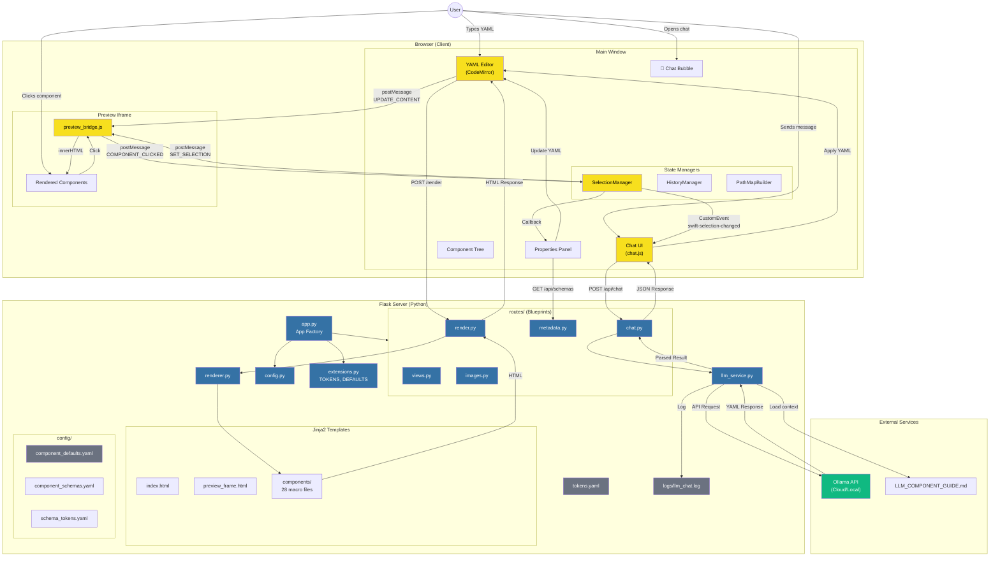
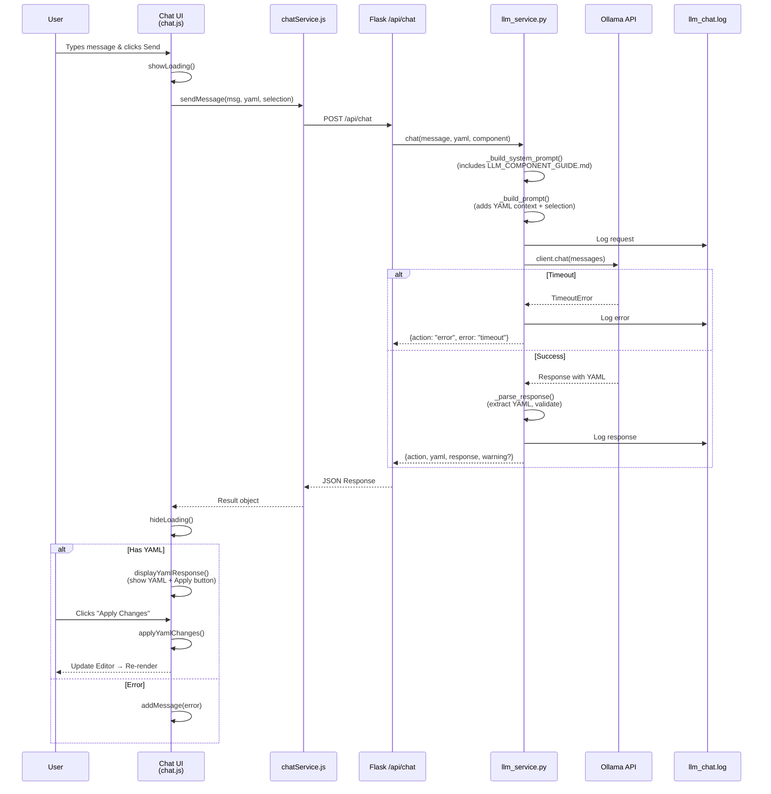
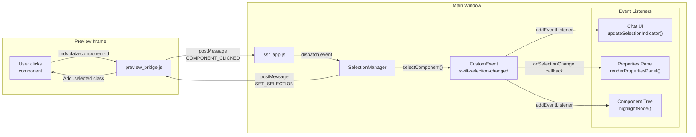
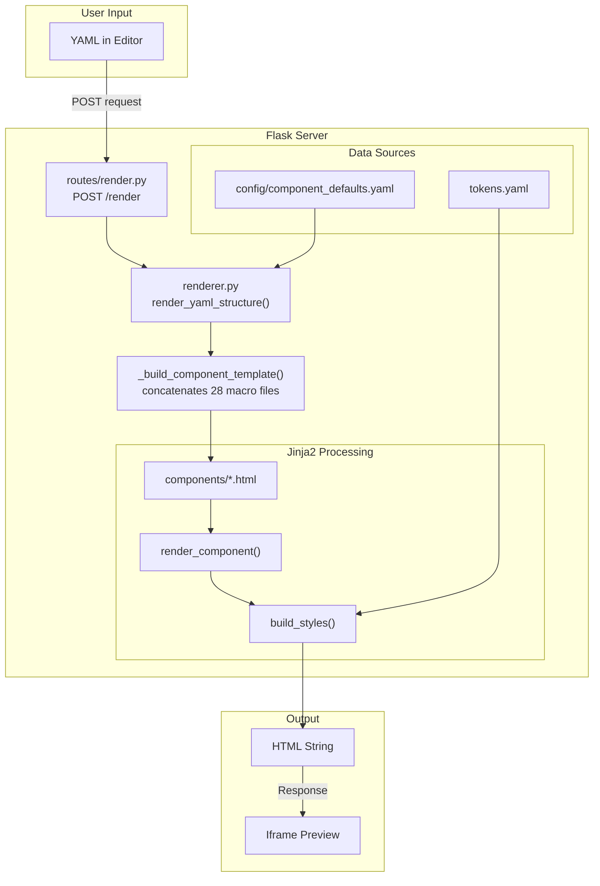
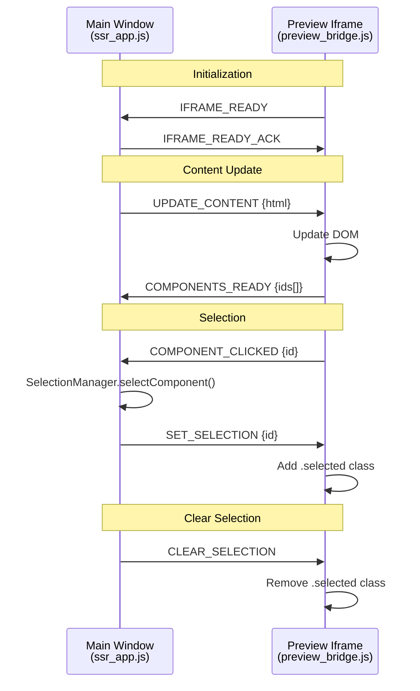

# Swift Sites Architecture

This document provides visual diagrams of the Swift Sites application architecture, focusing on the SSR rendering flow, LLM chat integration, and component selection system.

---

## Overall System Architecture

---

## LLM Chat Flow (Sequence Diagram)

---

## Selection Event System

---

## SSR Rendering Flow

---

## Iframe Communication Protocol

---

## File Structure Overview

```mermaid
flowchart TD
    subgraph Root["Project Root"]
        CLAUDE["CLAUDE.md"]
        LLMGuide["LLM_COMPONENT_GUIDE.md"]
        Docs["docs/"]
        ExampleTemplates["example_templates/"]
    end

    subgraph SSR["ssr_python/"]
        AppPy["app.py (factory)"]
        ConfigPy["config.py"]
        ExtPy["extensions.py"]
        RendererPy["renderer.py"]
        LLMServicePy["llm_service.py"]
        TokensYAML["tokens.yaml"]

        subgraph Routes["routes/"]
            ViewsBP["views.py"]
            RenderBP["render.py"]
            MetadataBP["metadata.py"]
            ImagesBP["images.py"]
            ChatBP["chat.py"]
        end

        subgraph ConfigDir["config/"]
            CompDefaults["component_defaults.yaml"]
            CompSchemas["component_schemas.yaml"]
            SchemaTokens["schema_tokens.yaml"]
        end

        subgraph Tests["tests/"]
            Conftest["conftest.py"]
            TestRenderer["test_renderer.py"]
            TestRoutes["test_routes.py"]
            TestSecurity["test_security.py"]
        end

        subgraph Templates["templates/"]
            IndexHTML["index.html"]
            PreviewHTML["preview_frame.html"]
            subgraph Components["components/ (28 files)"]
                Assembly["_assembly.html"]
                Utilities["_utilities.html"]
                Dispatcher["_dispatcher.html"]
            end
        end

        subgraph Static["static/"]
            subgraph JS["js/"]
                MainJS["main.js"]
                SSRAppJS["ssr_app.js"]
                PreviewBridgeJS["preview_bridge.js"]
                ChatJS["chat.js"]
                ChatServiceJS["chatService.js"]
                SelectionMgrJS["selectionManager.js"]
                PropsJS["propertiesPanel.js"]
            end

            subgraph CSS["css/"]
                StyleCSS["style.css"]
                ComponentsCSS["components.css"]
                ChatCSS["chat.css"]
            end
        end

        subgraph Logs["logs/"]
            ChatLog["llm_chat.log"]
        end
    end

    AppPy --> ConfigPy
    AppPy --> ExtPy
    AppPy --> Routes
    ChatBP --> LLMServicePy
    LLMServicePy --> LLMGuide
    LLMServicePy --> ChatLog
    RenderBP --> RendererPy
    RendererPy --> Components
    RendererPy --> TokensYAML
    ExtPy --> CompDefaults
    ExtPy --> TokensYAML
```

---

## Data Flow Summary

| Flow | Source | Destination | Method |
|------|--------|-------------|--------|
| YAML → HTML | Editor | Iframe | POST /render → postMessage |
| Selection | Iframe | Chat/Props | postMessage → CustomEvent |
| Chat Request | Chat UI | LLM Service | POST /api/chat |
| LLM Response | Ollama | Chat UI | JSON Response |
| Apply YAML | Chat UI | Editor | Direct DOM update |
| Properties Edit | Props Panel | Editor | YAML manipulation |

---

**Last Updated:** February 13, 2026
